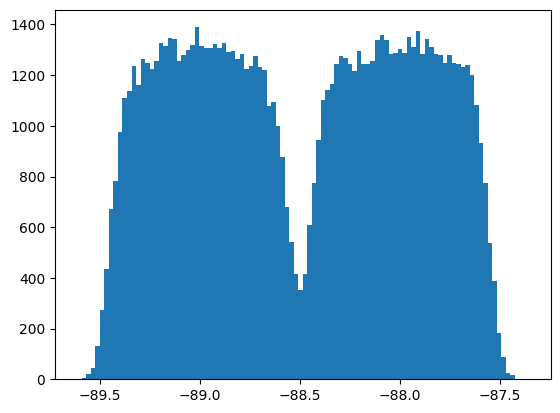

# sensitivities

Methods for linear and stochastic sensitivities analysis and uncertainty propagation.

## Install

You can install the `sensitivities` module using pip:

```shell
pip install sensitivities
```


## Usage

### `sensitivities.stochastic`

The `sensitivities.stochastic` module provides functionality for stochastic sensitivities analysis. It allows you to stochastically sample input parameters from various distributions and evaluate the sensitivities of a function to those inputs. Available distributions are 
- Gaussian (given mean and standard deviation)
- Uniform (between lower and upper bound)
- Discrete (multiple discrete options)

Example for stochastic sampling:

```python
from sensitivities.stochastic import sample, Gaussian, Uniform, Discrete, seed
import matplotlib.pyplot as plt

def my_function(a, b, c=0, d=0):
    return a + b + c + d

samples = sample(
    my_function,
    [Gaussian(10, 0.05), Discrete([1, 2])],
    {"c": Uniform(-0.4, 0.4), "d": -10},
    n=100000,
)

plt.hist(np.array(samples), 100)
plt.show()
```




### `sensitivities.linear`

This module contains the `propagate_uncertainties` function for propagation of uncertainties for a given function based on the principle of linear differentials. It makes use of the scipy function `approx_fprime` to calculate the partial derivatives of the given function. 

Here is a simple usage example:

```python
from sensitivities.linear import propagate_uncertainties

def my_function(x, y):
    return [x ** 2, x, y]

print(propagate_uncertainties(my_function, uncertainties=[0.1, 0.2], x0=[1, 1]))
```

This will output:

```python
(
    np.array([0.2, 0.1, 0.2]),
    np.array([[1.0, 1.0, 0.0], [1.0, 1.0, 0.0], [0.0, 0.0, 1.0]])
)
```


## Development

Setup development environment

```shell
uv sync --extra dev
```

